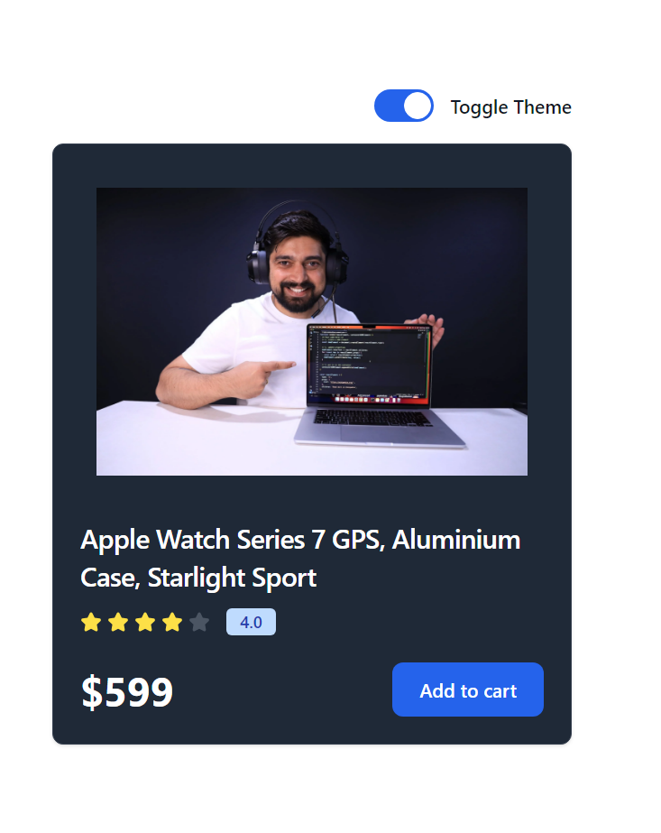

# 14-react Context API part 2
    In the previous part 1 we discussed about Context API and how to create it & use it.
    We have made 2 files for same context, but in this part2 we will do same thing but with different approach we will create Context API, and pass it's Provider through same single file.

To do this first create an React app :
```
npm create vite@latest
```      

## What we will build is Dark/Light Theme Mode :

We will make a single page dark/light theme mode enabled webpage.
Where we will use the toggle button to change the theme using Context API and apply those theme globally.

File structure :
```
React App :
    -src
       | -> components (folder)
       |     |- Card.jsx (for Card)
       |     |- ThemeToggle.jsx (for toggle button only)
       |
       | -> context (folder)
       |     |- ThemeContext.js
       |
       | -> App.jsx (We will use ContextProvider in this App.jsx file)
       | -> main.jsx
```
[Note : We used tailwind css for this project]

## Do Tailwind CSS configuration first, for this Theme Feature
Go to tailwind.config.js

Add darkMode property with value "class" like :
   
        /** @type {import('tailwindcss').Config} */
    export default {
        content: [
        "./index.html",
        "./src/**/*.{js,ts,jsx,tsx}",
        ],
        darkMode : "class",
        theme: {
            extend: {},
        },
        plugins: [],
    }
    

## let's start a Project Building :

Go inside "src" folder :
    
Create Folder with name 'context';
    
- Inside it create one File 'ThemeContext.js' which returns only js. 
- Do write this code :
    ```javascript
    import { createContext, useContext } from "react";

    export const themeContext = createContext({
    themeMode : "light",
    darkTheme : ()=>{},
    lightTheme : ()=>{}
    });//default value


    export const ThemeContextProvider = themeContext.Provider;

    export default function useTheme() {
    return useContext(themeContext);
    }
    ```

Now Go to App.jsx file :
- Import the ThemeContextProvider from 'context' folder like :
```javascript
    import { ThemeContextProvider } from './contexts/ThemeContext';
```

Inside the App function write this :
```javascript
    <ThemeContextProvider value={{themeMode, darkTheme, lightTheme}}>

      <div className="flex flex-wrap min-h-screen items-center">
        <div className="w-full">
          <div className="w-full max-w-sm mx-auto flex justify-end mb-4">
              <ThemeToggle />
          </div>

          <div className="w-full max-w-sm mx-auto">
              <Card />
          </div>
        </div>
      </div>

    </ThemeContextProvider>
```

Because the 'ThemeContextProvider' requires a value which has 1 variable and 2 functions which is by default empty. So, we first create those State variable and 2 functions with logic and pass it to 'ThemeContextProvider' which allow these to function globally.

```javascript
  const [themeMode, setThemeMode] = useState('light');

  const lightTheme = () =>{
      setThemeMode('light');
  }

  const darkTheme = () =>{
      setThemeMode('dark');
  }
```

Go to 'components' folder :
- Inside Card folder copy and paste the JSX as it is from Card.jsx
- Inside ThemeToggle.jsx, import useTheme from 'context' folder :
```javascript
    import useTheme from '../contexts/ThemeContext';
``` 

copy and paste the jsx file : 
```javascript
    export default function ThemeToggle() {
   
    return (
        <label className="relative inline-flex items-center cursor-pointer">
            <input
                type="checkbox"
                value=""
                className="sr-only peer"
                onChange={handleOnChange}
                checked = {themeMode === "dark"}
            />
            <div className="w-11 h-6 bg-gray-200 peer-focus:outline-none peer-focus:ring-4 peer-focus:ring-blue-300 dark:peer-focus:ring-blue-800 rounded-full peer dark:bg-gray-700 peer-checked:after:translate-x-full peer-checked:after:border-white after:content-[''] after:absolute after:top-[2px] after:left-[2px] after:bg-white after:border-gray-300 after:border after:rounded-full after:h-5 after:w-5 after:transition-all dark:border-gray-600 peer-checked:bg-blue-600"></div>
            <span className="ml-3 text-sm font-medium text-gray-900">Toggle Theme</span>
        </label>
    );
}
```

Do some changes to inside ThemeToggle function like :
```javascript
    const {themeMode, darkTheme, lightTheme} = useTheme();

    const handleOnChange = (e) =>{
        const theme_mode_status = e.currentTarget.checked;
        
        if(theme_mode_status){
            darkTheme();
        }else{
            lightTheme();
        }
    }
```

Your Project is done 

1. Light Mode :


2. Dark Mode :

Go visit my Linked Account go watch the demo video for this Project 
https://in.linkedin.com/in/ritesh-kumar-rai-bb6901296


## By  RITESH KUMAR RAI